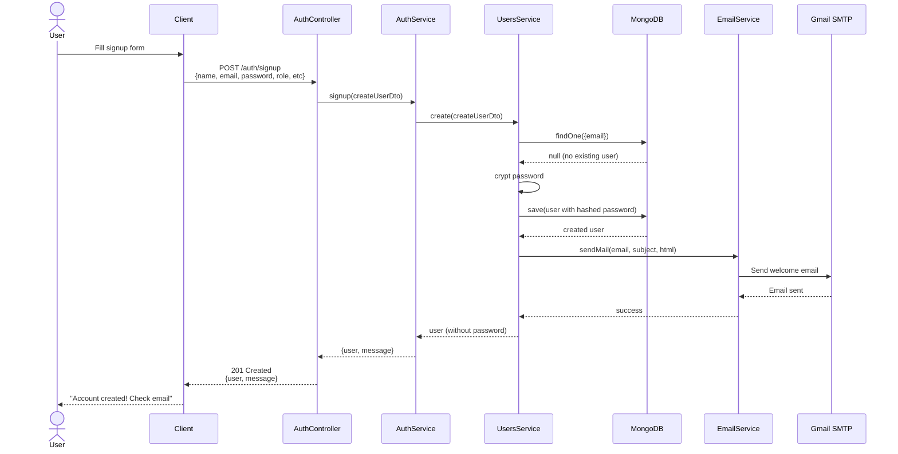
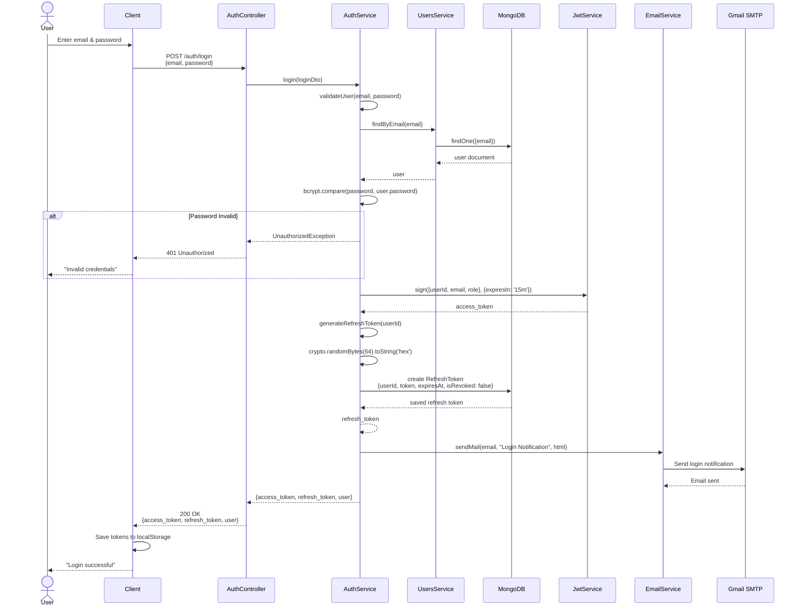
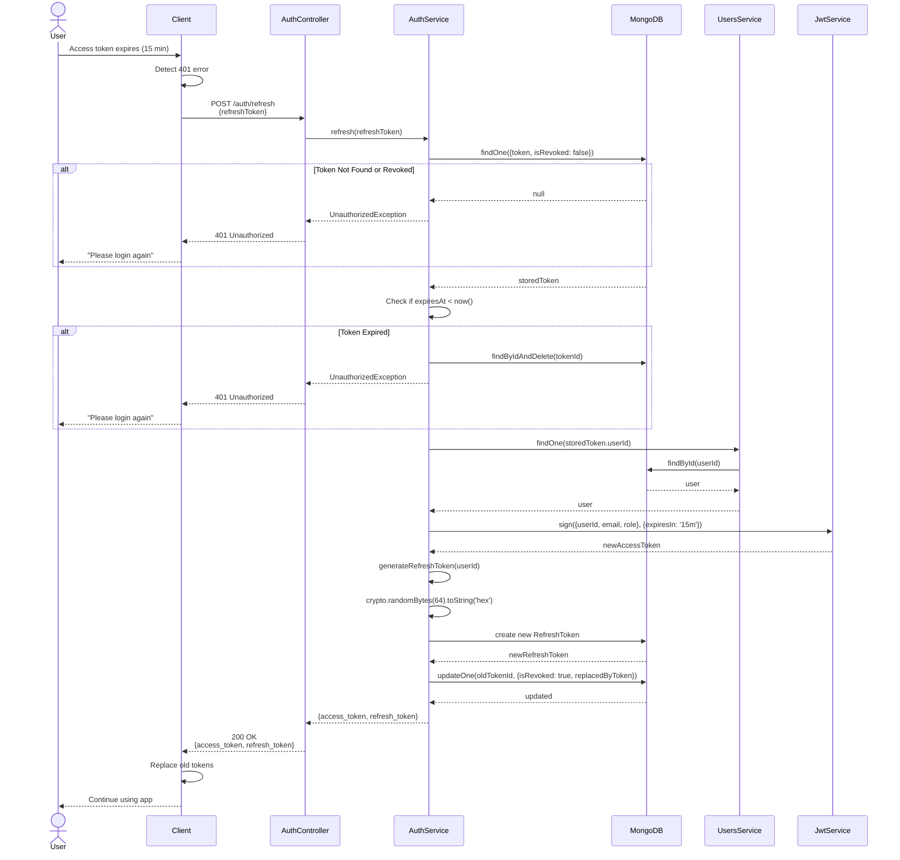
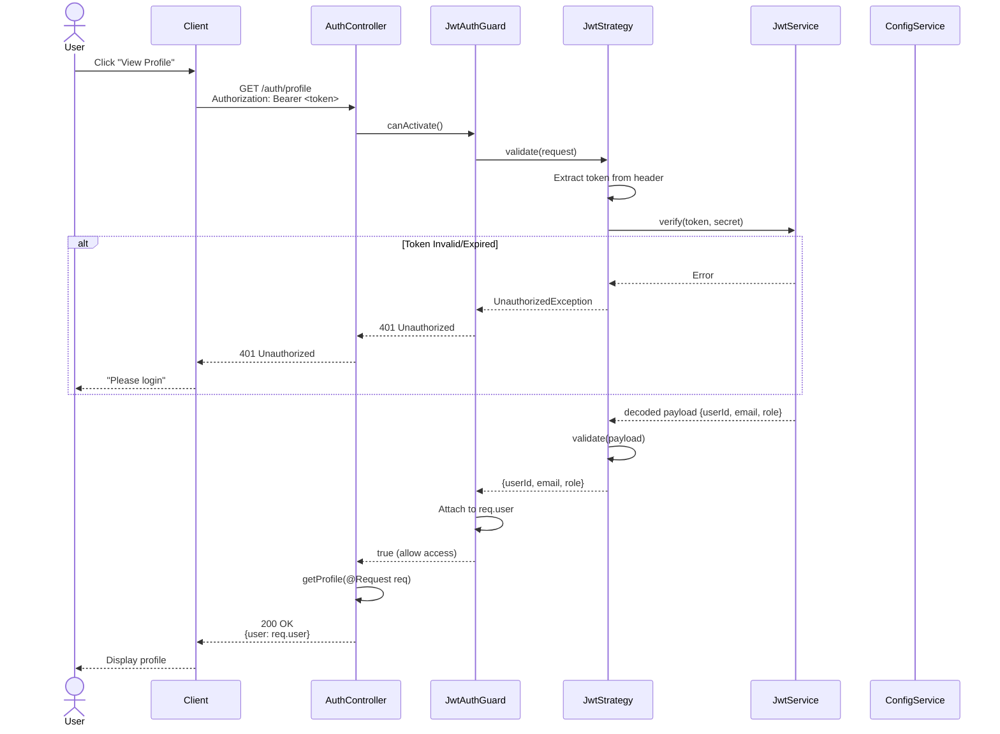
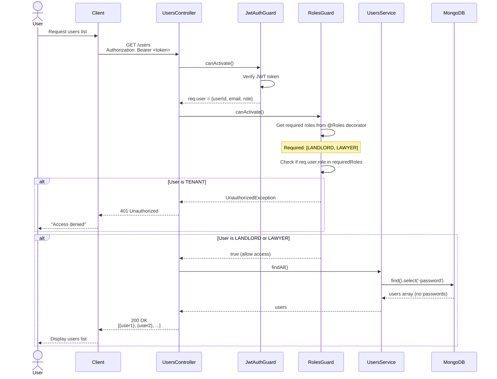
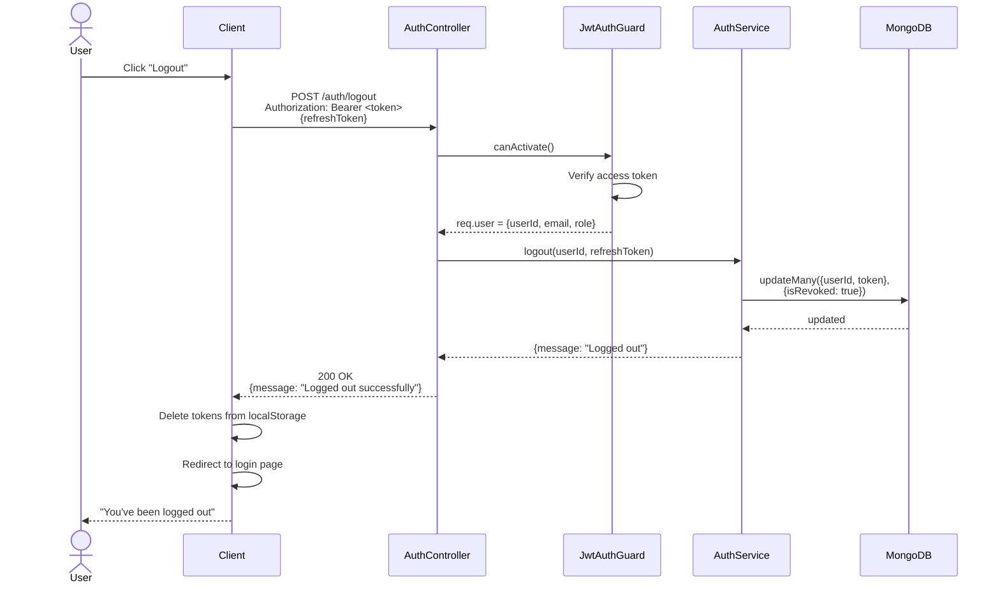
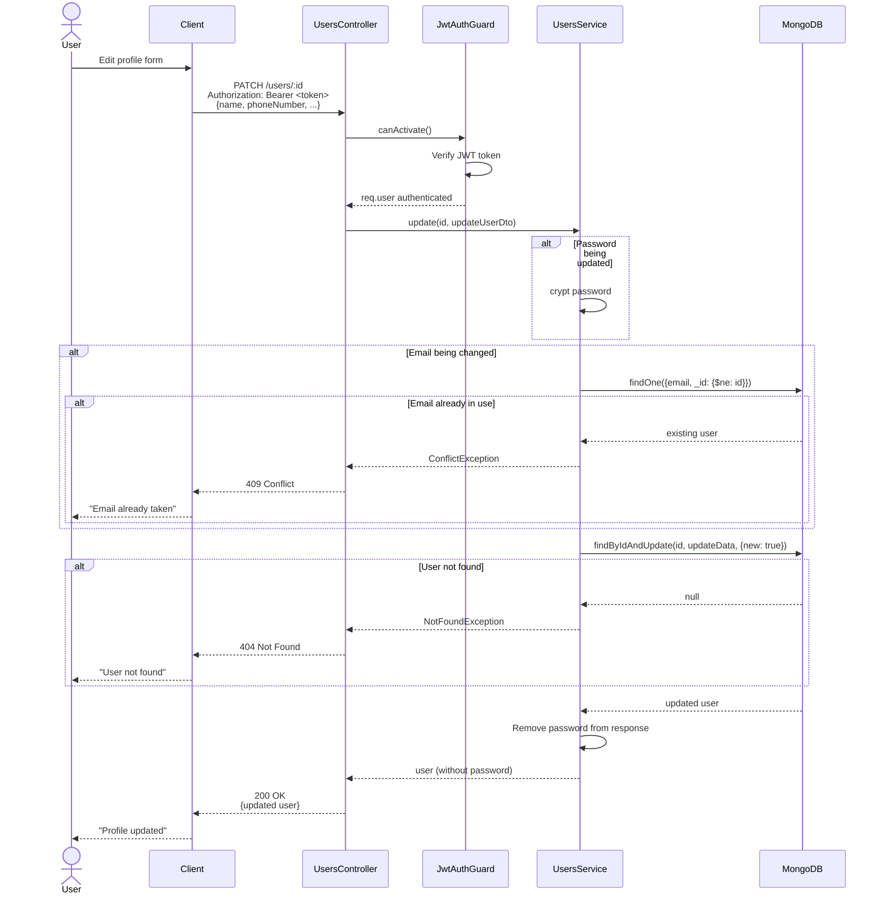
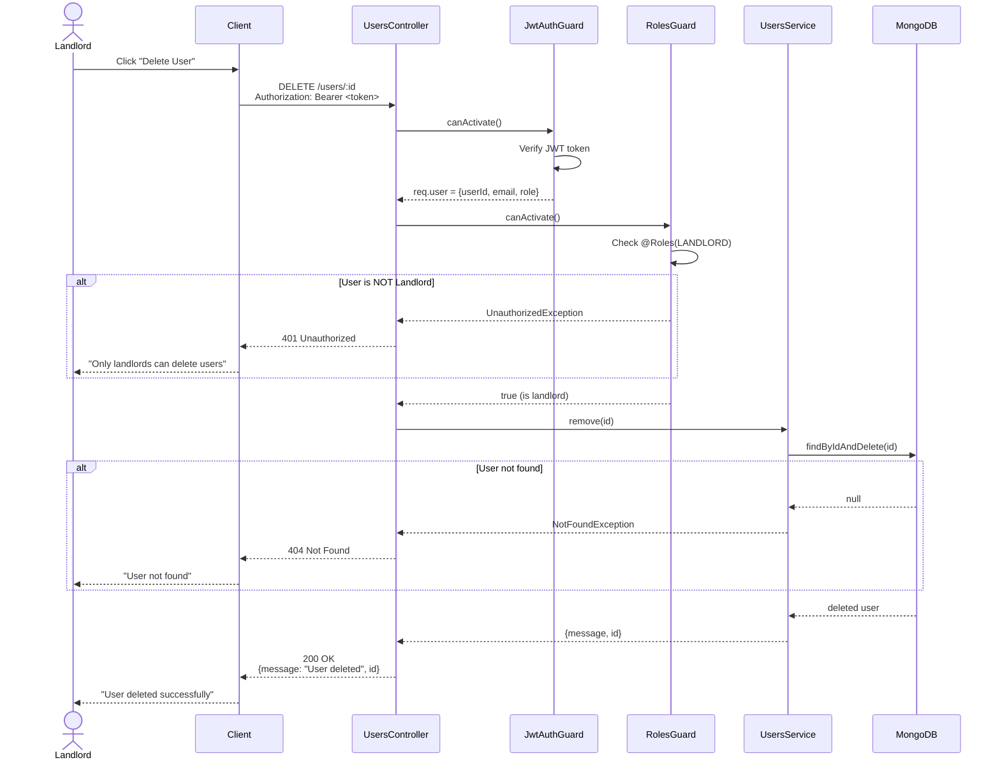
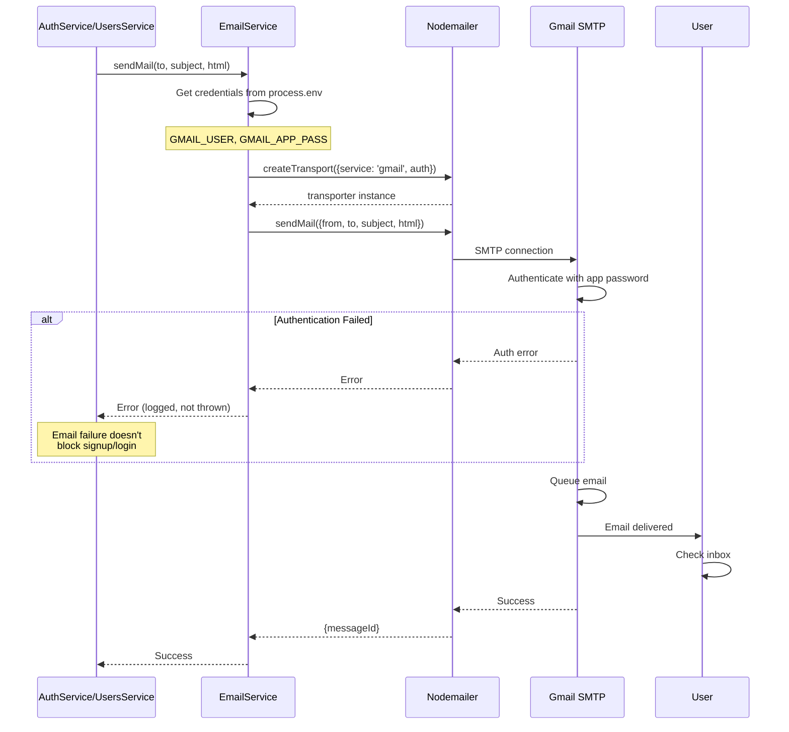

# Sequence Diagrams - Authentication & User Management System

## 🔐 1. User Signup Flow

---

## 🔑 2. User Login Flow

---

## 🔄 3. Token Refresh Flow

---

## 👤 4. Get Profile (Protected Route) Flow

---

## 📋 5. Get All Users (Role-Based) Flow

---

## 🔓 6. Logout Flow

## ✏️ 8. Update User Flow

---

## 🗑️ 9. Delete User (Landlord Only) Flow

---

## 📧 10. Email Notification Flow (Background)

